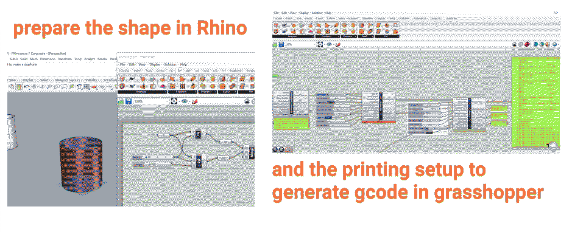
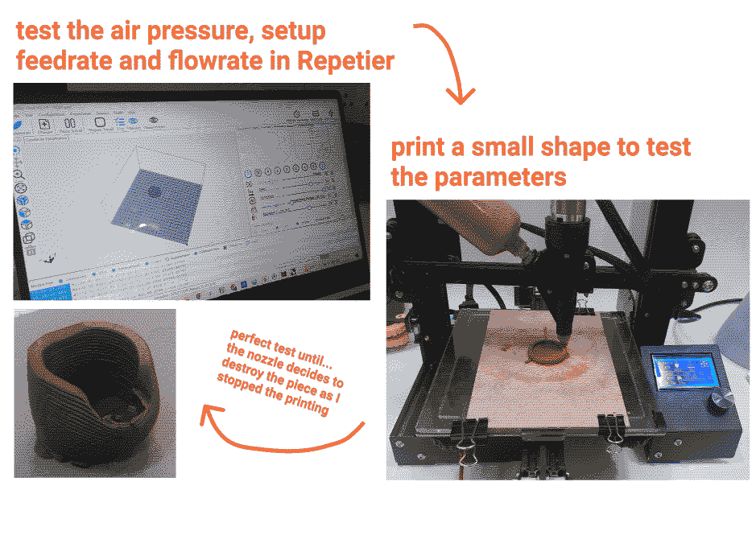
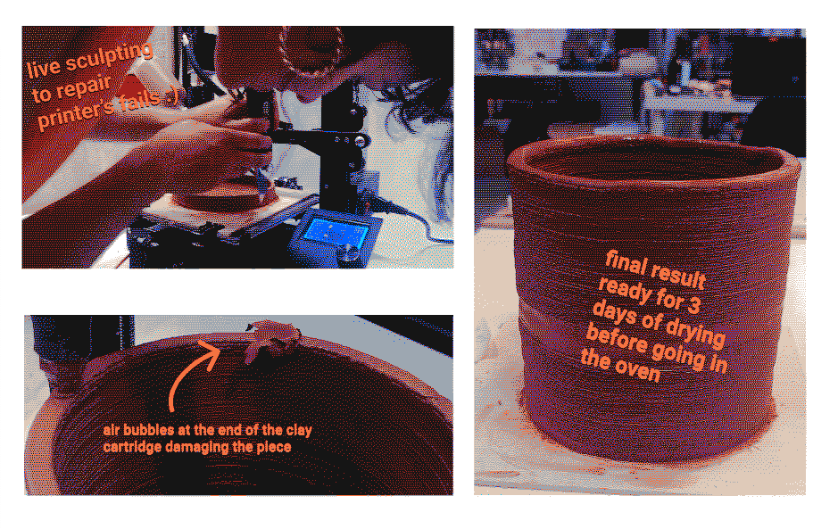
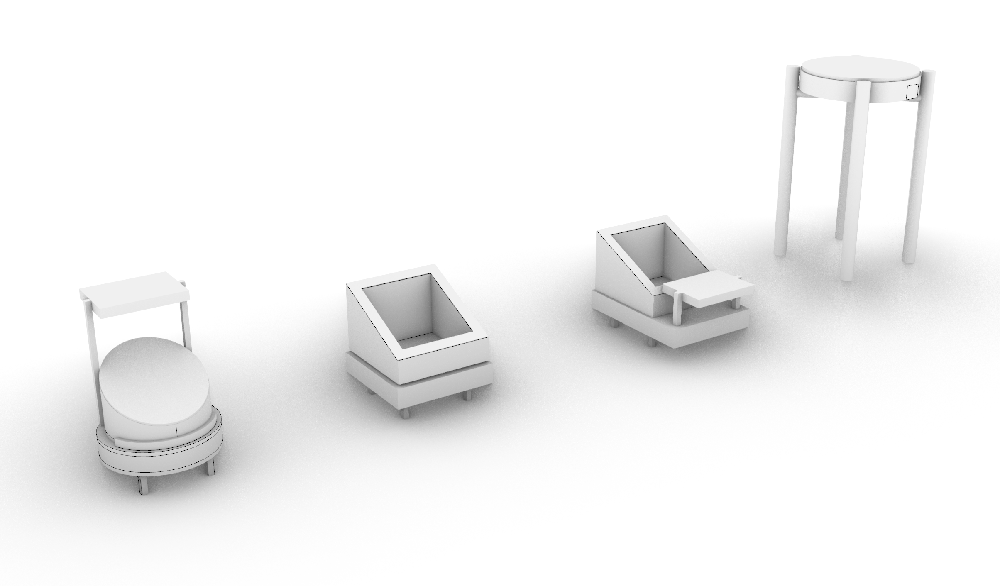
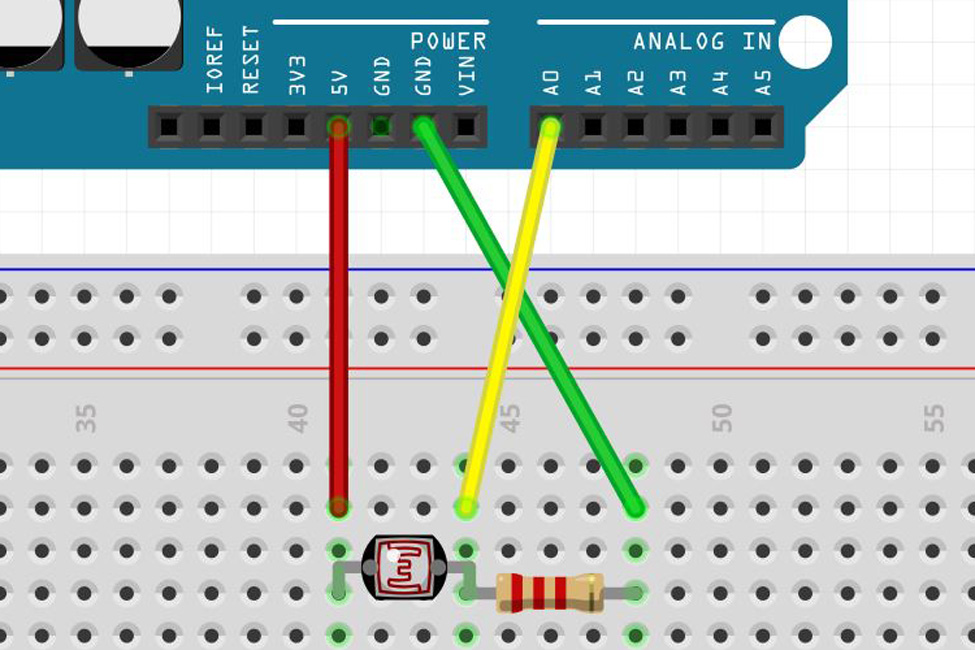
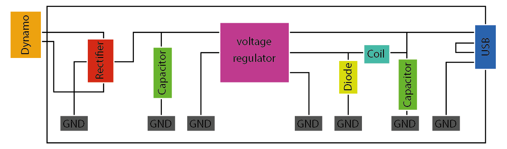
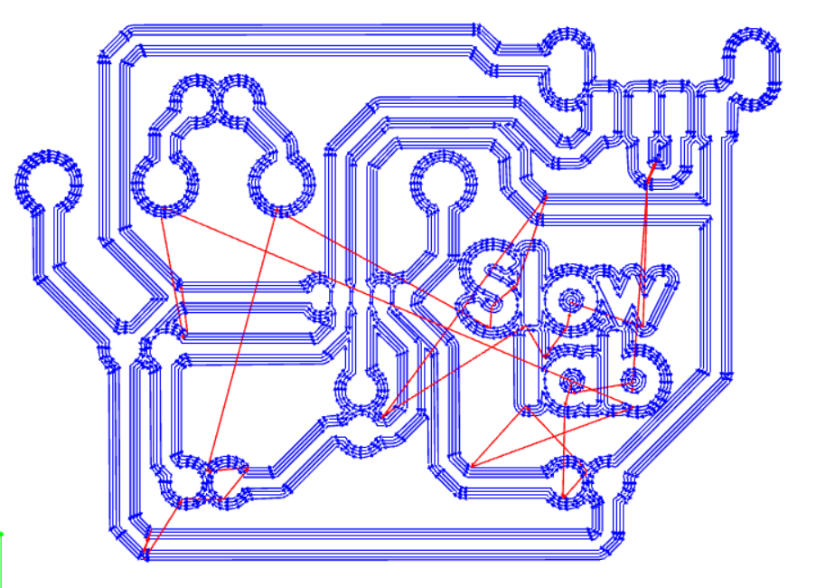
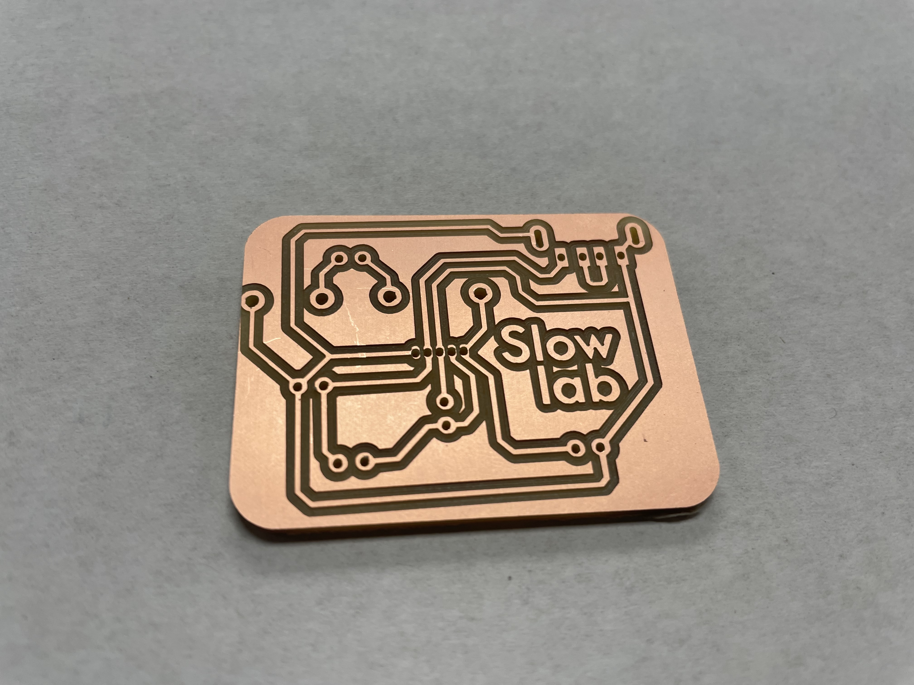
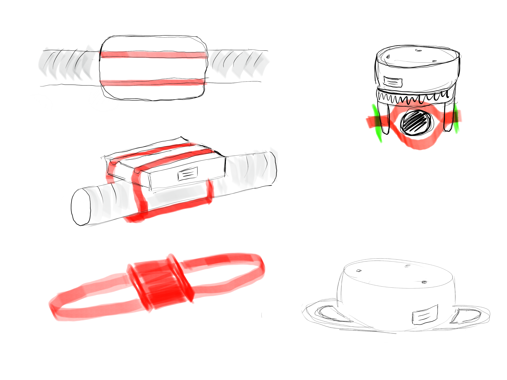
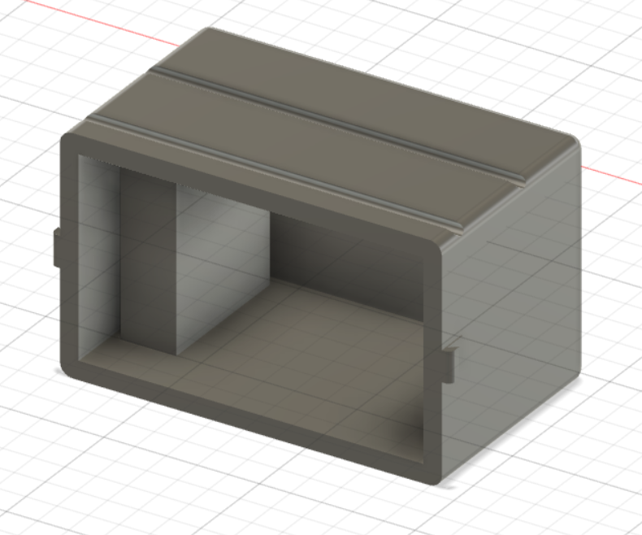

# Slow daily devices by the Slow Lab
### Audrey Belliot, Paula Bustos & Gerda Meleschkin

### Slow Lab
We want to explore ways in which we can live a more resilient lifestyle and try to implement systems that are less dependent on fossil fuel energy. By approaching this subject we started experimenting with a Solar Oven to see if you could use the energy of the Sun to heat up our food instead of the usual microwave or oven. With this we try to start a slow movement in which we bring awareness to our everyday habits and embrace a slower pace with processes. This will pave the way to enjoy more the moment and eliminate the rush of our daily activities by giving time for things to transform.

 

## Concept & purpose
For this challenge, we decided to work on a collection of artefacts that can be part of the "slow" and low tech daily routines we want to promote.

* Paula Solar energy:
  - Small version of a solar oven to attach to any window and that rotates to follow the sun

* Gerda Human energy:
  - Generator of electricity on the bike to power a device

* Audrey Human energy:
  - Bike generator (static bike) for homes to power 12-24V devices at 175-350W

* Audrey bottle cooler:
  - Clay printed wine cooler to refresh bottles using the principle of evaporation

* Data collection:
  - Live data: collect live data from the previous devices to control efficiency
  - Ad hoc analysis: collect data on a SD card from the sensors used on these devices to be able to create graphs or other data visualization and see efficiency levels.

## Planning
We separated the tasks between us based on our interests and on the skills we wanted to work on during the challenge:
* Gerda worked on the "mobile" bike generator with the dynamo
* Paula on the rotating stand for solar ovens (or other devices that need to follow the sun)
* Audrey on the clay printed wine cooler and the home bike generator

We decided to focus on these devices first and work on the data collection at the end if we had some extra time.

## Clay wine cooler
Steps:
- Make a design on Rhino for a simple “vase” shape without thickness

     Notes:
    Size limitations to take into account: printer plate 20x20 / kiln 20x20x15 height
     The size will reduce of about 10-15% after cooking

- Measurements : perimeter wine bottle 23-24 cm / diametre 8 cm → I will leave around 2-3 cm for water around the bottle so the wine cooler can be 13 cm diameter. + If it reduces of 10-15% when cooking I need to do it 15 cm diameter
- In Grasshopper, I created a cylinder and a circle with the same center point and radius and merged them.
- I "baked" the shape and opened the file with gcode for the paster printer slicer
- Use the  latest version of the Grasshopper file to generate the gcode
- Open the software "Repetier", connect it to the Ender printer and check the "z" value when we add a base. Then change this value in the Grasshopper setup.

- Copy the Grasshopper code into Repetier

- Preparing the machine.

    - Launch the print
During the print it is important to stay close to the printer to adjust the pre

- Let dry for at least 2 days, cook and increase the temperature every hour, let cool down during the night

Points of attention

### Build of materials
- 2 cartridges of clay for a cooler of 15 cm diameter and 16 cm height

## Rotatory Base with sunlight tracking

I started by following two tutorials for reference, one from instructables and another from a student of fabacademy previous years.
- <a href="https://www.instructables.com/Plant-Rotator/">Automatic plant rotator with sunlight sensor.</a>
- <a href="http://archive.fabacademy.org/fabacademy2017/fablabseoul/students/351/final.html">Automatic rotatory solar panel.</a>

-We wanted to build a rotatory base in which we could put the solar oven and automatically turns looking for the sun. The idea of this base is that it can be used for different things that need the sunlight like plants or algae. At first we had the idea of using gears with the servomotor to help the base rotate easier with more weight but then we realised that the servomotor would be losing a lot of angles to turn around. In the end we decided to leave only the servomotor to rotate the base. We found a Lazy Susan bearing turntable at the FabLab and decided to use it to enable the rotation.

### Design
The Design was initially thought to be round but then when thinking about the fabrication process we decided to make it square. When we found the lazy susan wheel we decided to go back to the circular design. Circular shapes are always more tricky to make because you need a curved material. As we decided to use MDF for this prototype we just used living hinges to create the circular perimeter walls. Eventually we would like to add the legs that would attach to the window and some way to attach the oven or planters on top that can be easily changed.

### Process
-At first we wanted the design to be a rectangle because this would make the fabrication a lot easier. After deciding to use the lazy susan we went ahead with using the round shape. So we started by taking measurements of the servomotor and lazy susan holes so we could laser cut the bases to which the lazy susan wheel would be attached. This was tricky and took some time. After having all the measurements and the layers needed we went ahead and laser cut. We got some nuts and bolts to assemble the lazy susan with the laser cut circle and electronics.

### Electronics
-We first started testing each component individually and seeing if it works properly. These are the schematics of each of the main components.

-Servomotor

-Photoresistor

-After trying both the servo and the photoresistors we then worked on the code. So what we want is to measure the amount of light coming from both sensors and then analyze the difference between both values in order to tell the motor where to turn to. So the logic of this is that if there is more light in the photoresistor A than in photoresistor B then the motor would turn to the photoresistor A. Right now we just worked with 2 photoresistors but eventually we would like to put some more so we can have different angles to turn the oven to. We still need to figure out a way of installing the photoresistors in the base so that the tracker can be in place and we can have the electronics inside the box.

-This is the code we used for programming the electronics...
-For now the motor is rotating very fast so we need to change the speed of the rotation and the angle so it doesn't turn complete 180 degrees but a bit less.

### Build of materials
-Servomotor FEETECH 20kg impermeable FT5323M. (4.8v- 6v)
-12 inch lazy susan turntable bearing
-2 Photoresistor 2PCS
-Breadboard
-ESP32 Feather
-2 10k resistors
-Jumping wires
-MDF 2.5 mm

## Portable bike electricity generator

I started following tutorials to make generator for a dynamo, which could provide 5V to one device though a USB connector.
Then my idea was to make a low tech navigation system, which is connected with the phone through bluetooth while using openstreet map.

### Design

### Process

#### PCB
1. I designed the Eschema while collecting the datasheets and check the connections
2. I finished the PCB design with Kicad
3. Exporting it as SVG files
4. I	created three rml files
    	traces speed 3, 1/64 mill traces
      outline speed 1.5, 1/32 mill traces
      holes speed 3, 1/32 mill traces

#### Eletronics
1. I soldered the components
2. Connected all the connections with the mulitmeter
3. Connected the dynamo
4. Had problems, some parts were the other way around
5. After soldering and changing some parts ot worked

#### Case
1. I designed i case for the generator, because i want to attach it to several bycicles
2. I 3D printed

### Build of materials
- 1 Dynamo
- 1 Diode 1N5819
- 1 USB Connector Typ A 2.0
- 1 Bridge Rectifier B40C1500A
- 1 Capasitor 330 µF
- 1 Capasitor 100 µF
- 1 Voltage Regulator LM2575T-5G
- 1 Coil Coil 330µH

## Home bike generator
As we are questionning our dependency towards fossile fuels and energy in general, we wanted to create a device that anybody could have at home to produce their own energy.
We are creating a bike generator out of an old vintage home bike. It will be also used as part of our Slow Lab event, the next one being a solar brunch during MDEFest.

The inspiration for this bike generator comes from Low Tech Magazine and his author Kris de Decker with whom we have been collaborating for a few months now. The manual he shared in his website has been very useful.
<a href="https://www.lowtechmagazine.com/2022/03/how-to-build-bike-generator.html>Manual Low Tech Magazine</a>

Day 1
- Test 1: make the motor turn with a driller an measure the voltage with a multimeter - we only reached 8V.
- Test 2: check if our 12-24V amplifier would still work with only 8V. We used a power supply for this test. And it worked.
- Test 3: connect the motor-generator to the amplifier and turn the shaft with the driller → the music was playing!

Day 2
The objective was to attach a spindle to the motor to make it turn with the wheel of the static bike.
There is a formula to calculate the spindle diameter based on the expected voltage we want to produce.
The motor we use is a 24V DC motor (350W, 2750RPM). If we search the specifications of this motor, it has a no-load speed of 3300 RPM at 24V. It is proportional so it means we have 1650 no-load RPM at 12V.

The formula to calculate the spindle diameter is
Spindle diameter = (PS*W*RPM pedals)/(WS*RPM generator)

- PS = pedal sprocket diameter = **190mm**
- W = flywheel diameter = **530mm**
- RPM pedals = how fast you pedal = we take an average of **60RPM**
- WS = flywheel sprocket diameter = **60mm**
- RPM generator = the no-load RPM of the generator = **1650 at 12V**

It means that to produce 12V, we need a spindle diameter of:

(190*530*60)/(60*1650)= 61.03030303mm we will round it to **60mm.**

However, if we follow this manual, we need to produce more than 12V to anticipate energy losses and we will still be able to convert it to 12V with a voltage converter.

So if we use this formula for 17V we have, we have the same data except for the no-load RPM which is 1650/12*17=2337

(190*530*60)/(60*2337)= 43.08943089 so we will round it to **43mm.**

For 15V it would be:

No-load RPM= 1650/12*15=2063

(190*530*60)/(60*2063)= 48.81240911 so we will round it to **48mm.**

For 14V it would be:

No-load RPM= 1650/12*14= 1925

(190*530*60)/(60*1925)= 52.31168831 so we will round it to **52mm** **.**

Now how to make a spindle?!

We went to Cauchos Barcelona in Poblenou where they sell different compenents made of rubber. There we found 2 sizes:

- one with a diameter of 48mm
- one with a diameter of 40mm which is initially a door stop

We first tried with the 48mm piece. We drilled a hole of 6.5mm in the center and pushed it into the metal shaft of the motor that has a diameter of 7.8mm. We add a nut on the other side to hold it. We had to buy a specific “left-nut” to attach on the screw of the motor.

We managed to produce around 18V with it when pedaling at a good speed without stopping.

Day 3
- The spindle from day 2 was a getting damaged by the friction so we had to change it and found a small wheel at Servei Estacio that we could attach to the motor shaft
- We added a diode to make sure the current flows only in one direction as we are here using a motor as a generator
- We added also a capacitor to make the voltage more steady
- We made a small wood support to attach the motor to the bike

Next steps
- Add fruses
- Make a more stable support
- Add a dimmer

### Build of Materials
- Vintage second hand home bike
- Second hand MY1016 350W 24V 2750RPM DC motor
- Rubber “wheel”bought at Cauchos Barcelona
- Nut turning on the left to attach to the motor shaft
- Conversor DC-DC adjustable 5A 75W
- Diode 6A

## Dissemination plan
- We would like to have a lot of our designs open source for everyone to make use of. Our goal is to create a movement and invite people to try for themselves the low-techs. With this we also intend for people to use their creativity to readapt the materials the have at hand or materials they recover into their devices.

As of now we are trying to do some events in which we attract people into this movement and engage with the community by providing unique experiences around low-techs. We want to collaborate with other members of the community that can add up to our project as well. Eventually we would like to grow into bigger events like the festivals that happen all year round in Barcelona. For now our future plans are Modular festival, Solar Biennale, Sonar and maybe even Primavera Sound! We would also like to keep our events versatile and talk about more things than just solar ovens so people know that this is something more than just changing the way we cook. Spinning studios are also one option to collaborate with, we could plan classes in which we generate electricity from their bikes. These events are one of the ways in which we can grow and sustain our project.

Another idea is to sell some of the products we designed specifically. We could sell them to anyone that wants to try these low techs by themselves and doesn't want to or has no time to build their own.

## Setbacks

-The Majority of the setbacks we had were regarding electronics and finding specific pieces that we needed for our projects. In the case of the rotary base I struggled a lot to get right the holes of the lazy susan in the mdf laser cut piece. Also finding the right screws because they had to be a specific size so they didn't interfere with the rotation. The shape was also tricky and when cutting the living hinge for the circle's perimeter I had to scale it down because it didn't fit the laser bed.

## Files

 

## Photos

## Our personal websites
- <a href="https://audrey-belliot.github.io/mdef/fabacademy.html">Audrey Belliot</a>
- <a href="https://gerda-meleschkin.github.io/newwebsite/fabacademy/fabacademy.html">Gerda Meleschkin</a>
- <a href="https://paula-bustos.github.io/peebee/">Paula Bustos</a>
