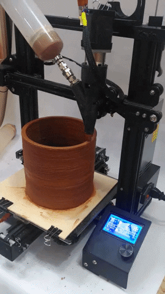

# Slow daily devices by the Slow Lab
### Audrey Belliot, Paula Bustos & Gerda Meleschkin

### Slow Lab
We want to explore ways in which we can live a more resilient lifestyle and try to implement systems that are less dependent on fossil fuel energy. By approaching this subject we started experimenting with a Solar Oven to see if you could use the energy of the Sun to heat up our food instead of the usual microwave or oven. With this we try to start a slow movement in which we bring awareness to our everyday habits and embrace a slower pace with processes. This will pave the way to enjoy more the moment and eliminate the rush of our daily activities by giving time for things to transform.

 

## Concept & purpose
For this challenge, we decided to work on a collection of artefacts that can be part of the "slow" and low tech daily routines we want to promote.

* Paula Solar energy:
  - Small version of a solar oven to attach to any window and that rotates to follow the sun

* Gerda Human energy:
  - Generator of electricity on the bike to power a device

* Audrey Human energy:
  - Bike generator (static bike) for homes to power 12-24V devices at 175-350W

* Audrey bottle cooler:
  - Clay printed wine cooler to refresh bottles using the principle of evaporation

* Data collection:
  - Live data: collect live data from the previous devices to control efficiency
  - Ad hoc analysis: collect data on a SD card from the sensors used on these devices to be able to create graphs or other data visualization and see efficiency levels.

## Planning
We separated the tasks between us based on our interests and on the skills we wanted to work on during the challenge:
* Gerda worked on the "mobile" bike generator with the dynamo
* Paula on the rotating stand for solar ovens (or other devices that need to follow the sun)
* Audrey on the clay printed wine cooler and the home bike generator

We decided to focus on these devices first and work on the data collection at the end if we had some extra time.

## Fabrication process

### Clay wine cooler
Steps:
    - Make a design on Rhino for a simple “vase” shape without thickness
     Notes:
    Size limitations to take into account: printer plate 20x20 / kiln 20x20x15 height
     The size will reduce of about 10-15% after cooking
    - Measurements : perimeter wine bottle 23-24 cm / diametre 8 cm → I will leave around 2-3 cm for water around the bottle so the wine cooler can be 13 cm diameter. + If it reduces of 10-15% when cooking I need to do it 15 cm diameter
    - In Grasshopper, I created a cylinder and a circle with the same center point and radius and merged them.
    - I "baked" the shape and opened the file with gcode for the paster printer slicer
    - Use the  latest version of the Grasshopper file to generate the gcode
    - Open the software "Repetier", connect it to the Ender printer and check the "z" value when we add a base. Then change this value in the Grasshopper setup.
    - Copy the Grasshopper code into Repetier

- Preparing the machine.

    - Launch the print
During the print it is important to stay close to the printer to adjust the pre

- Let dry for at least 2 days, cook and increase the temperature every hour, let cool down during the night

Points of attention

### Build of materials
- 2 cartridges of clay for a cooler of 15 cm diameter and 16 cm height

## Rotatory Base with sunlight tracking

I started by following two tutorials for reference, one from instructables and another from a student of fabacademy previous years.
- <a href="https://www.instructables.com/Plant-Rotator/">Automatic plant rotator with sunlight sensor.</a>
- <a href="http://archive.fabacademy.org/fabacademy2017/fablabseoul/students/351/final.html">Automatic rotatory solar panel.</a>

-We wanted to build a rotatory base in which we could put the solar oven and automatically turns looking for the sun. The idea of this base is that it can be used for different things that need the sunlight like plants or algae. At first we had the idea of using gears with the servomotor to help the base rotate easier with more weight but then we realised that the servomotor would be losing a lot of angles to turn around. In the end we decided to leave only the servomotor to rotate the base. We found a Lazy Susan bearing turntable at the FabLab and decided to use it to enable the rotation.

### Design
The Design was initially thought to be round but then when thinking about the fabrication process we decided to make it square. When we found the lazy susan wheel we decided to go back to the circular design. Circular shapes are always more tricky to make because you need a curved material. As we decided to use MDF for this prototype we just used living hinges to create the circular perimeter walls.

*image of hinge
*image of the round shape

### Process
-At first we wanted the design to be a rectangle because this would make the fabrication a lot easier. After deciding to use the lazy susan we went ahead with using the round shape. So we started by taking measurements of the servomotor and lazy susan holes so we could laser cut the bases to which the lazy susan wheel would be attached. This was tricky and took some time. After having all the measurements and the layers needed we went ahead and laser cut. We got some nuts and bolts to assemble the lazy susan with the laser cut circle and electronics.

### Electronics
-We first started testing each component individually and seeing if it works properly. These are the schematics of each of the main components.

-Servomotor
*insert image of schematic

-Photoresistor
*insert image of schematic

-After trying both the servo and the photoresistors we then worked on the code. So what we want is to measure the amount of light coming from both sensors and then analyze the difference between both values in order to tell the motor where to turn to. So the logic of this is that if there is more light in the photoresistor A than in photoresistor B then the motor whould turn to the photoresistor A. Right now we just worked with 2 photoresistors but eventually we would like to put some more so we can have different angles to turn the oven to.

-This is the code we used with some comments to understand what everything is meant for.

*

### Build of materials
-Servomotor FEETECH 20kg impermeable FT5323M. (4.8v- 6v)
-12 inch lazy susan turntable bearing
-2 Photoresistor 2PCS
-Breadboard
-ESP32 Feather
-2 10k resistors
-Jumping wires
-MDF 2.5 mm

## Home bike generator
As we are questionning our dependency towards fossile fuels and energy in general, we wanted to create a device that anybody could have at home to produce their own energy.
We are creating a bike generator out of an old vintage home bike. It will be also used as part of our Slow Lab event, the next one being a solar brunch during MDEFest.

The inspiration for this bike generator comes from Low Tech Magazine and his author Kris de Decker with whom we have been collaborating for a few months now. The manual he shared in his website has been very useful.
<a href="https://www.lowtechmagazine.com/2022/03/how-to-build-bike-generator.html>Manual Low Tech Magazine</a>

### Build of Materials

## Dissemination plan

## Setbacks

## Files

 

## Photos

## Our personal websites
- <a href="https://audrey-belliot.github.io/mdef/fabacademy.html">Audrey Belliot</a>
- <a href="https://gerda-meleschkin.github.io/newwebsite/fabacademy/fabacademy.html">Gerda Meleschkin</a>
- <a href="https://paula-bustos.github.io/peebee/">Paula Bustos</a>
