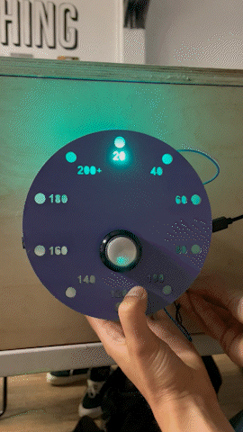

# Solar thermometer  by the Slow Lab
### Audrey Belliot, Paula Bustos & Gerda Meleschkin

  
  

This is the documentation of our process of design and fabrication of a solar oven for FabAcademy microchallenge 

## Concept & purpose

We want to explore ways in which we can live a more resilient lifestyle and try to implement systems that are less dependent on fossil fuel energy. By approaching this subject we started experimenting with a Solar Oven to see if you could use the energy of the Sun to heat up our food instead of the usual microwave or oven. With this we try to start a slow movement in which we bring awareness to our everyday habits and embrace a slower pace with processes. This will pave the way to enjoy more the moment and eliminate the rush of our daily activities by giving time for things to transform.

We decided to explore the possibility of adding a thermometer so we could transmit the data to the user at the moment of cooking and to collect the data for future developments of the prototype. 

**Physical interface**
The system will work with a heat sensor wired to an ESP32 microcontroller in which we can integrate some led lights to communicate to the user the temperature that the oven is reaching. 

**Digital interface**
We will also add a small LCD screen displaying the cronometer so they can know how much time their oven has been runnning and in this way make the user experience more reliable for a first approach to this alternative technologies.

**Community platform**
The collected data will go into a platform in which we can display it for the users and create a community in which they can share their progress and tips regarding their use of the oven. This will help us develop improvements to the prototype and understand how the user feels about these alternative systems and low-techs.

      
    

 

## Planning
We started by listing the tasks that needed to be done and then dividing them into priorities and iterations. We decided to start with electronics so we can get the system running and see what other questions emerge. Once we gather the needed electronics parts we can start testing in a breadboard to see program the code needed and the functions desired. For this first iteration we will focus on gathering the temperature data and showing it through the led lights.

  

- Day 1:

Making sketches and brainstorming ideas on how to represent the intended data. There will be a start button that will activate the data collection and start the timer. The same button will turn off the data collection and timer. Gathering the LED Neonpixel strip, a breadboard, jumping wires, ESP32 Feather and velleman temperature sensor. We started with the connections and testing the sensor and LED lights to see if they worked properly. We downloaded the arduino libraries for both components. For the LED lights we used the Adafruit_neopixel simple library and for the temperature sensor it's DHT sensor library. We got it up and running and then we started customizing the color of the LED lights to go from light yellow to orange and finally to red in the highest temperature. The plans for the circle board containing the electronics and display were also started so we can be able to laser cut tomorrow.

- Day 2: 
_electronics_
We continued testing the electronics, we were able to design bthe code so the LED lights could light up depending on the temperature they reach. Also by each set of temperature range a different led color would light up. The temperature was also working and we could see the changes in it, but we still needed to figure out how to combine them together. After some testing we managed to merge both codes. We still need to add the button so it knows when to start gathering the data and when to stop. Also we realised that the sensor that we were using was only going until 50 degrees so we decided to use a different one called NTC thermistor which can reach higher temperatures. 

_physical interface_
We also laser cut the circle to which the leds and electronics would be attached to and would display the temperature. 

_solar oven improvements_
As for the fabrication we continued to make arrangements to the oven. We screwed the hinge to the mirror door on top and added inner insulation with some cork we rescued from the FabLab. We wanted to finish the oven as soon as possible so we could test it and see how it works. 

_solar speakers_
We are also simultaneaously working on building a set of speakers that could be powered by the sun. We managed to get them working with 2 17V/5W panels. The speakers work with 5v/4W so we needed to step down the voltage. And the connected them in parallel so they could gather more energy. 

- Day 3:
 
_testing the oven_
We tested today the solar oven with the sun that came out. We were excited to try it with the mirrors because the reflection would surely help a lot. We went to the rooftop to try it but it didn't go more than 61 degrees. Also, we realised our termometer wasn't working so we opened it up and fixed it. All we needed to do was fix the soldering of a cable which was disconnected. After realising the temperature was not going up we came to the conclusion that we needed to change the tinted glass we had on top because it was preventing the heat to go past it. We unscrewed the top and removed the extra silicon and bought a new clear window so we can test it. 

_electronics_
For the electronics we managed to get the code up and running with the new temperature sensor (NTC) and the different lights turning on depending on the degrees. So we started soldering the LED lights to make them in a circle. We cut the LED string where the lines are marked and cut small cables so we could interconnect them. Once we had the cabled we started soldering one to the other until we were sure that we had a closed circuit. We tested with the multimeter and the ground and voltage were emitting sound when touched but the data in and out were not. So we went and checked every connected, unsoldered and soldered back again. We were starting to get frustrated and then we found out it doesn't make a sound, it just has to display a number. So actually maybe they were well connected from the beginning. But now we know and we kept going. 

_digital interface_
We connected the electronics to p5Js to display the temperature and a graph line showing the evolution in time.
  

- Day 4: 
_electronics_
Continuing the soldering of the LED circle
Soldering all the components to be able to remove the breadboard

_solar oven and speakers_
Finished making arrangements to the oven. Attaching the new transparent glass

_solar speaker_
We tested the speakers with an amplifier to replace the car radio amp that we didn't manage to make work on day 3.
We made a wooden box to fit the second hand speakers and the amplifier. 

*sketching*
 

 
 

## Fabrication process

### Design
*Integrated design (how you designed it-relation between elements)
*Honest Design (use of technology in a meaningful way, in relation to the topics)
*Be creative, find solutions with materials and technology you have.
*Explore design boundaries (based on your expertise)

We were trying to use the less material possible or to use the scraps that we had around the FabLab. We decided then to use the plywood scraps and build the prototypes manually so no use of CNC was needed. This helped us also to get more acquainted with the machines in the workshop and to gain confidence in our fabrication skills. We only used the laser cutter for more precise dimensions and for smaller details. Also to laser cut the acrylic ring that would diffuse the light of the LEDs. We wanted to leave our design in a crude finish so we can also promote the use of less things and display the essential things only. Also it gives a more natural look. 

### Electronics

For the electronics we tried to reuse most of our parts. We used the kit we had from the beginning of the course for the basics like breadboard, adafruit feather, wires and for the LEDs we cut and reused some that we found in the FabLab. The speakers and amplifier were gifted to us from a car workshop and FabLab. Also the solar panels were borrowed from the FabLab. In this way we were sure to reuse and try to rescue as much of the electronics as we could and leave our design more responsible towards our environment. 

//We started testing the temperature sensor with a breaboard so we connected ground (-) and voltage (+) to USB. The pin we used is A0.
//For the LED lights we used the NeonPixel strip. We connected to ground (-), voltage (+) to usb and the pin A1. We realised this was the only pin that worked for //some reason. We added a resistor in between the jumping wires of 330ohms. 

### Process

  

### Material Needed

- Rescued plywood
- Rescued metacrylate
- Small rescued piece of MDF
- 2 17v solar panels
- Rescued car radio amplifier
- second hand amplifier
- Second hand speakers
- Rescued speakers
- Screws
- Rescued mirrors and glass

 

## Future development opportunities
*Listed future development opportunities for this project

 

## Build of Materials
Iteration process, spiral development

NTC Thermistor
Potentiometer
Neopixel LED Strip that we cut and resolder to fit the circle piece that we laser cut
100k ohm resistor for the button

Text

## Setbacks
Described problems and how the team solved them

## Files
*Design and fabrication files open source or open format

- <a href="https://github.com/gerda-meleschkin/slowlab/blob/main/files/Inner%20box%20-%20solar%20oven%20v4.dxf">Inner box</a>
- <a href="https://github.com/gerda-meleschkin/slowlab/blob/main/files/slowlab_solaroven_outside_box.dxf">Outer box</a>
- <a href="https://github.com/gerda-meleschkin/slowlab/blob/main/files/Sheets%20-%20solar%20oven.dxf">Sheets</a>
- <a href="https://github.com/gerda-meleschkin/slowlab/blob/main/files/Slow%20lab%20writing.dxf">Label</a>

 
 

## Photos
*Photos of end artifact

## Our personal websites
- <a href="https://audrey-belliot.github.io/mdef/fabacademy.html">Audrey Belliot</a>
- <a href="https://gerda-meleschkin.github.io/newwebsite/fabacademy/fabacademy.html">Gerda Meleschkin</a>
- <a href="https://paula-bustos.github.io/peebee/">Paula Bustos</a>
